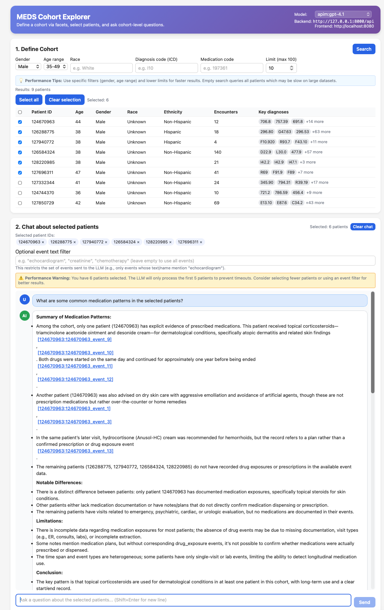

# MEDS MCP
MEDS Model Context Protocol (MCP) Server and Client

> [!WARNING]
> **LLM Client Library**: This repository uses `secure-llm`, a private library for invoking secure LLM calls through Stanford's infrastructure. The `secure-llm` library follows the same API interface as [aisuite](https://github.com/andrewyng/aisuite), so extending this codebase to work with other approved LLM providers is technically feasible, but **not currently implemented**. PRs welcome. All demos currently require Stanford VPN connectivity and appropriate API credentials.

## Prerequisites

This project uses [uv](https://github.com/astral-sh/uv) for dependency management. Install uv if you haven't already and sync the project dependencies:

```bash
uv sync
```

This will create a virtual environment and install all required dependencies. All commands should be run using `uv run` to ensure the correct environment is used.

## Quick Start

Get up and running with MEDS MCP in four steps:

### 0. Set Environment Variables

Set up the required environment variables before running any commands:

```bash
export REDIVIS_ACCESS_TOKEN="your_redivis_api_key_here"
export VAULT_SECRET_KEY="your_apim_key_here"
```

> **Note:**
> - `REDIVIS_ACCESS_TOKEN`: Required for downloading MedAlign data (see [Data Setup](#data-setup) for access requirements)
> - `VAULT_SECRET_KEY`: Required for Stanford APIM LLM access (VPN connection required)

### 1. Download Data

Download the MedAlign dataset using the provided script:

```bash
uv run python scripts/download_data.py medalign --files
```

### 2. Launch Server

Start the MCP server with the default configuration:

```bash
uv run python src/meds_mcp/server/main.py --config configs/medalign.yaml
```

The server will start on `http://localhost:8000` by default.

### 3. Launch Demo

Run the Gradio chat demo to interact with patient records:

```bash
uv run python examples/mcp_chat_demo/evidence_review_demo.py \
  --model apim:gpt-4.1-mini \
  --mcp_url "http://localhost:8000/mcp" \
  --patient_id 127672063
```

> **Note:** See [MCP Chat Demo](#mcp-chat-demo) for recommended LLM models and additional options.

## Data Setup

### MedAlign Dataset

The MedAlign dataset contains de-identified EHR data and requires access approval from Stanford.

#### Apply for Access to MedAlign

> [!CAUTION]
> The Stanford Dataset DUA prohibits sharing data with third parties including LLM API providers. We follow the [guidelines for responsible](https://physionet.org/news/post/gpt-responsible-use) use as originally outlined by PhysioNet:
>
> *If you are interested in using the GPT family of models, we suggest using one of the following services:*
>
> - *Azure OpenAI service. You'll need to opt out of human review of the data via this form. Reasons for opting out are: 1) you are processing sensitive data where the likelihood of harmful outputs and/or misuse is low, and 2) you do not have the right to permit Microsoft to process the data for abuse detection due to the data use agreement you have signed.*
> - *Amazon Bedrock. Bedrock provides options for fine-tuning foundation models using private labeled data. After creating a copy of a base foundation model for exclusive use, data is not shared back to the base model for training.*
> - *Google's Gemini via Vertex AI on Google Cloud Platform. Gemini doesn't use your prompts or its responses as data to train its models. If making use of additional features offered through the Gemini for Google Cloud Trusted Tester Program, you should obtain the appropriate opt-outs for data sharing, or otherwise not perform tasks that require the sharing of data.*
> - *Anthropic Claude. Claude does not use your prompts or its responses as data to train its models by default, and routine human review of data is not performed.*

#### Download MedAlign Data

```bash
uv run python scripts/download_data.py medalign --files
```

> **Note:** Make sure `REDIVIS_ACCESS_TOKEN` is set in your environment (see [Quick Start](#quick-start)).

> [!TIP]
> **Tumor Board Patients in MedAlign**
>
> These patients' records make mention of "tumor board".
>
> `125718675`, `126035422`, `126061094`, `126394715`, `126467596`, `127672063`, `127807353`, `127850729`, `127969918`, `127980943`, `128126942`

### [OPTIONAL] Athena OMOP Ontologies

The Athena OMOP ontologies provide standardized medical terminology mappings. These ontologies are to support all MCP server tools. The ontologies are expected to be located at `data/athena_omop_ontologies/` with the following files:

- `descriptions.parquet` - Concept descriptions
- `descriptions.trie` - Search index
- `parents.parquet` - Parent-child relationships

To set up the ontologies:

1. **Download Athena Snapshot:**
   - Option 1: Download a [cached snapshot](https://drive.google.com/drive/folders/1F59yqlGzyYOWQoa7nHQJSRc1gpl6Lo--?usp=sharing) (recommended for quick setup)
   - Option 2: Create an account and login to [Athena OHDSI](https://athena.ohdsi.org/vocabulary/list) to download the most recent version of public vocabularies

2. **Initialize Parquet Files:**
   Run the initialization script to convert the Athena snapshot to the required Parquet format and build the lookup trie:

   ```bash
   uv run python scripts/init_athena_ontologies.py \
     --athena_path data/athena_ontologies_snapshot.zip \
     --custom_mappings data/stanford_custom_concepts.csv.gz \
     --save_parquet data/athena_omop_ontologies
   ```

   > **Note:** The `--custom_mappings` flag is optional. If you don't have custom Stanford concepts, you can omit this parameter. The script will process the ontology snapshot and create optimized Parquet files for fast lookup.

## Configuration

### Server Configuration YAML

Lightweight configuration for launching the MCP server

```yaml
# Server settings
server:
  host: "0.0.0.0"
  port: 8000

# Data directories
data:
  # Ontology data directory
  ontology_dir: "data/athena_omop_ontologies"
  # Corpus/collections directory
  corpus_dir: "data/collections/dev-corpus"
  # Use lazy loading for ontology (true/false)
  use_lazy_ontology: false

# Logging settings
logging:
  level: "INFO"
  format: "%(asctime)s - %(name)s - %(levelname)s - %(message)s"
```

### Launch Commands

#### Launch Server
```bash
uv run python src/meds_mcp/server/main.py --config configs/medalign.yaml
```

#### Test Client
```bash
uv run python scripts/test_mcp_client_sdk.py
```

## MCP Chat Demo

LLM performance for evidence citation varies wildly. You should use the latest frontier LLM available to you.



### Available Models

**APIM Models:**
- `apim:gpt-4.1`
- `apim:gpt-4.1-mini`
- `apim:gpt-4.1-nano`
- `apim:o3-mini`
- `apim:claude-3.5`
- `apim:claude-3.7`
- `apim:gemini-2.0-flash`
- `apim:gemini-2.5-pro-preview-05-06`
- `apim:llama-3.3-70b`
- `apim:llama-4-maverick-17b`
- `apim:llama-4-scout-17b`
- `apim:deepseek-chat`

**Nero Models** (requires GCP/Nero Vertex API):
- `nero:gemini-2.0-flash`
- `nero:gemini-2.5-pro`
- `nero:gemini-2.5-flash`
- `nero:gemini-2.5-flash-lite`

**Recommended for best performance:**
- `apim:gpt-4.1-mini` or `apim:gpt-4.1` (fast, good quality)
- `apim:o3-mini` (latest OpenAI model)
- `nero:gemini-2.5-pro` (best quality, requires GCP access)

### Gradio Interface (Evidence Review)

```bash
uv run python examples/mcp_chat_demo/evidence_review_demo.py \
  --model apim:o3-mini \
  --mcp_url "http://localhost:8000/mcp" \
  --patient_id 127672063
```

### React Interface (Lightweight Chat)

```bash
uv run python examples/mcp_chat_demo/react_chat_demo.py \
  --model apim:gpt-4o-mini \
  --mcp_url "http://localhost:8000/mcp" \
  --patient_id 127672063
```

> **Note:** Make sure `VAULT_SECRET_KEY` is set in your environment (see [Quick Start](#quick-start)).

## Development Roadmap

See [docs/roadmap.md](docs/roadmap.md) for planned features and improvements.